<div align="center">

# Disosang — 지역화폐 가맹점 지도 검색

지역화폐(천안사랑카드)로 결제할 수 있는 가게를 **지도 위에서 빠르고 정확하게** 찾아주는 서비스

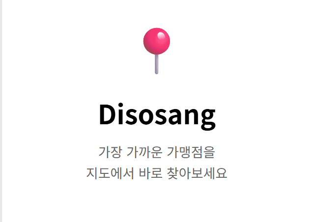

</div>

---

## 프로젝트 소개

지역화폐는 "내 동네에서 쓸 수 있는 가게"를 찾는 게 사용자의 핵심 목적입니다.
하지만 가맹점이 수만 개라, **지도를 움직일 때마다 빠르게 / 원하는 가게를 정확히** 찾아주지 못하면
사용자는 서비스 자체를 신뢰하지 않게 됩니다.

그래서 Disosang은 **"검색이 곧 서비스의 입구"** 라는 관점에서,
지도 영역 기반 가게 검색의 **속도와 품질**을 끝까지 끌어올리는 데 집중했습니다.

> **이 저장소는 해커톤에서 시작한 프로젝트를, 제가 맡았던 기능을 가져와 단독으로 재구축·개선한 버전입니다.**
> - 해커톤 당시 구현하지 못했거나 아쉬웠던 **지도·가게 검색 기능**을 가져와 직접 개선/재구현했습니다.
> - 프론트엔드는 처음부터 다시 작성했습니다 (**React → Thymeleaf**).
> - 본 서비스 흐름과 무관한 **결제 기능은 제거**하고, 핵심인 **지도·검색·가게 도메인**에 집중했습니다.

---

## 진행 형태 / 기간

| 구분 | 내용                                      |
|------|-----------------------------------------|
| 원본 | 해커톤 팀 프로젝트 (지도·가게 검색 파트 담당)             |
| 본 저장소 | 담당 기능 단독 재구축 · 검색 엔진 개선                 |
| 담당 범위 | 백엔드 전체 · 프론트(Thymeleaf) 재작성 · DB 설계 · 부하 테스트 |
| 기간 | 2026.03 ~ 진행 중            |

---

## 주요 기능

- **지도 기반 가게 검색** 
  - 화면에 보이는 영역 안에서 가게를 검색 (공간 인덱스 기반)
  - 정확 일치 · 앞부분 일치 · 부분 일치(중간/끝) · 오타 보정 · 장소 기반 검색("천안역 카페")
  - 검색 결과를 점수·리뷰 수·거리로 재정렬해 가장 관련 있는 가게를 먼저 노출
- **가게 상세 / 지도 포커스** — 상세 정보, 지도에서 해당 가게로 포커스 이동, 길찾기 연동
- **리뷰 / 사진** — 가게별 리뷰 작성·조회, 사진 업로드
- **찜(즐겨찾기)** — 관심 가게 저장/해제
- **카테고리 정규화** — 비정형 업종명을 표준 카테고리 트리로 정리해 "음식점" 같은 상위 검색의 누락 해소
- **회원 / 인증** — 회원가입·로그인 (Spring Security)

---

## 기술 스택

**Backend**  


**Database**  


**Frontend**  


**Test / Docs**  


---

## 아키텍처

별도 배포 인프라 없이 동작하는 **계층형 모놀리식** 구조입니다.
대신 **DB 안쪽(공간 인덱스 · 토큰 역색인 · 카테고리 트리)** 설계에 깊이를 두었습니다.

<div align="center">

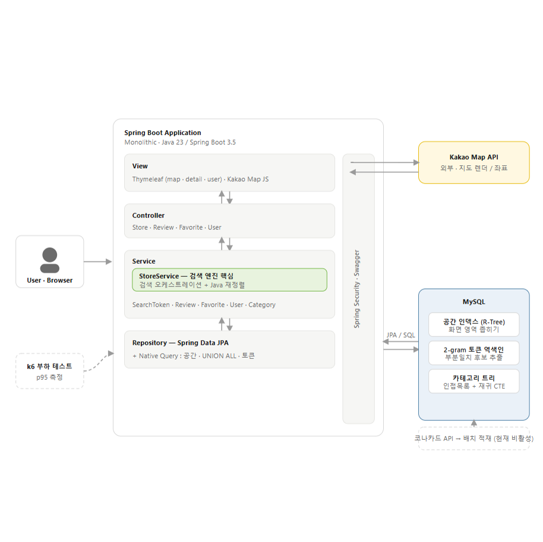

</div>

> **요청 흐름** — 사용자가 지도를 움직이면 → `View(Kakao Map)` 가 검색 요청 → `Controller → StoreService` 가
> 공간 인덱스로 영역을 좁히고 토큰/이름으로 후보를 모은 뒤 Java에서 최종 랭킹 → 결과를 지도에 렌더.

---

## ERD

핵심 도메인(가게·검색·리뷰·찜·카테고리) 기준 ERD입니다.

<div align="center">

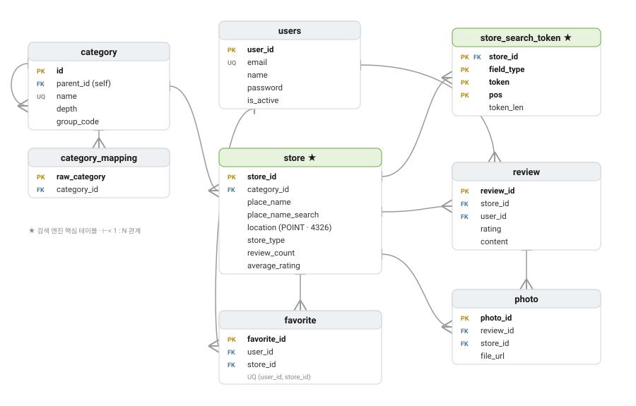

</div>

- **`store` ↔ `store_search_token`** — 매장명을 2-gram으로 분해해 저장하는 역색인 (1:N, `ON DELETE CASCADE`)
- **`category` (self-ref)** — `parent_id` 로 표현하는 카테고리 트리(인접목록), `category_mapping` 으로 비정형 업종명을 표준 id로 번역
- **`store`** — `location(POINT, SRID 4326)` 공간 컬럼 + `place_name_search` 등 검색 정규화 컬럼 보유

---

## 핵심 — 지도 가게 검색 엔진 개선

같은 검색 기능을 **3차에 걸쳐** 성능과 품질 양쪽에서 개선했습니다.

| 단계 | 한 일 | 검색 p95 | 트레이드오프 |
|------|-------|---------|------------|
| **1차** | `LIKE '%키워드%'` 풀스캔 → 공간 인덱스 + 정규화 컬럼 prefix | **812ms → 110ms** | 속도 ↑ / 검색이 '앞부분 일치'로 좁아짐 |
| **2차** | 부분일치·오타·장소 검색 추가 | **110ms → 1.62s** | 품질 ↑ / `LOCATE` 풀스캔으로 부하 시 성능 붕괴 |
| **3차** | `LOCATE` → **2-gram 토큰 역색인** 으로 교체 | **1.62s → 434ms** | 부분일치 품질을 **유지하며** 속도 회복 |

> **p95** = 응답의 95%가 이 시간 안에 완료 — 평균과 달리 가장 느린 구간까지 챙기는 지표

**설계 요점**

- **"DB는 후보 추출, Java는 최종 랭킹"** 으로 책임 분리 — SQL은 인덱스 잘 타는 후보 추출만, 자주 바뀌는 랭킹 정책은 테스트 가능한 Java에서
- **직접 만든 2-gram 토큰 역색인** — n-gram FULLTEXT의 noise(`"맑은닭칼국수"`에 `"맑은이비인후과"` 매칭)를 피하려고, 토큰을 "후보 추출"로만 쓰고 임계값·점수상한·Java 재정렬로 품질을 직접 통제
- **인덱스/옵티마이저 레벨 결정** — 공간 인덱스로 먼저 좁히고 `FORCE INDEX` + CTE `MATERIALIZATION`으로 "지역 먼저" 전략을 강제

---

## 프로젝트 폴더 구조

<details>
<summary><b>Back-end</b></summary>

```
disosang/src/main/java/com/pmh/disosang/
├── map/store/                      # 지도·가게·검색 (핵심 도메인)
│   ├── controller/                 # StoreController, StoreBatchController
│   ├── service/
│   │   ├── StoreService.java               # 검색 오케스트레이션 + Java 재정렬
│   │   ├── StoreSearchTokenService.java     # 2-gram 토큰 생성/관리
│   │   └── StoreSearchTokenBatchService.java # 토큰 backfill
│   ├── entity/                     # Store, Category, StoreSearchToken
│   ├── StoreRepository.java        # 공간·UNION ALL·토큰 네이티브 쿼리
│   └── dto/
├── review/                         # 리뷰·사진
├── favorite/                       # 찜
├── user/                           # 회원·인증
└── config/                         # Security, Web 설정
```

</details>

<details>
<summary><b>Front-end</b> (Thymeleaf + Vanilla JS)</summary>

```
disosang/src/main/resources/
├── templates/                  # Thymeleaf 화면
│   ├── home/home.html          # 메인(지도) 페이지
│   ├── store/
│   │   ├── map.html            # 지도 가게 검색 화면
│   │   └── detail.html         # 가게 상세
│   ├── user/                   # 로그인 / 회원가입 / 내 정보
│   │   ├── login.html
│   │   ├── signup.html
│   │   └── userInfo.html
│   └── welcome.html
└── static/
    ├── js/
    │   ├── map.js              # 지도·검색 인터랙션 (Kakao Map)
    │   ├── detail.js           # 가게 상세
    │   ├── directions.js       # 길찾기(현위치 기반)
    │   └── signup.js
    └── css/                    # map / detail / signup / userInfo / welcome
```

</details>

<details>
<summary><b>기타</b></summary>

```
disosang/sql/        # 토큰 테이블 DDL 등 마이그레이션
load_test/           # k6 부하 테스트 결과 (버전별)
docs/                # 설계 해설 등 문서
```

</details>

---

## 화면 구성

사용자가 **가게를 찾아 → 살펴보고 → 찜하고 → 길을 찾는** 흐름을 따라 구성했습니다.

### 1. 시작 — 랜딩 / 로그인 / 회원가입

| 랜딩 | 로그인 | 회원가입 |
|:---:|:---:|:---:|
| 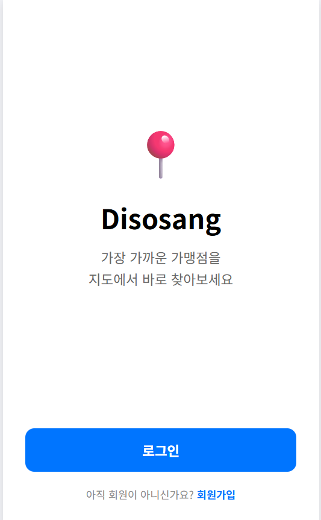 | 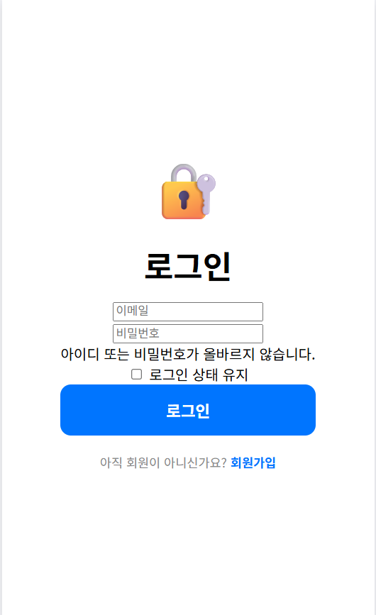 | 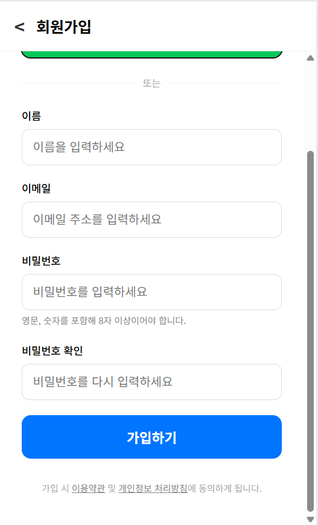 |

### 2. 지도 검색 

화면에 보이는 영역 안에서 검색하고, 카테고리로 거르고, 핀·목록을 누르면 하단에 가게 정보가 뜹니다.

| 지도 검색 | 카테고리 + 목록 | 가게 선택 |
|:---:|:---:|:---:|
| 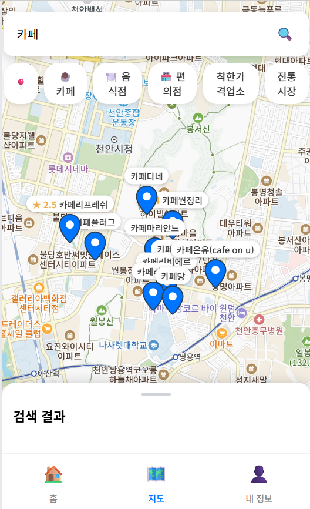 | 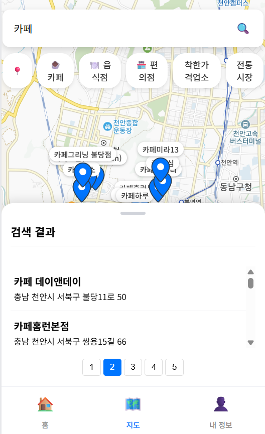 | 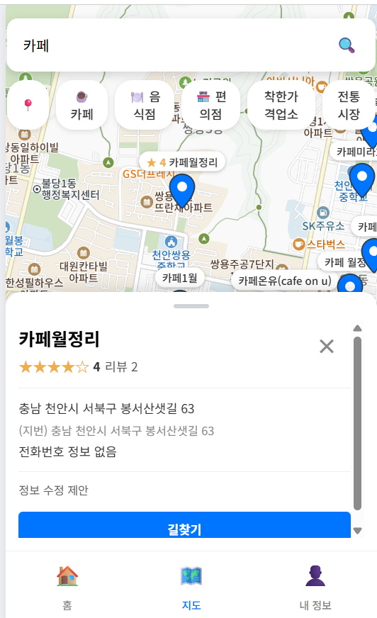 |
| 키워드로 검색 → 지도 위 핀 + 결과 목록 | 업종 필터 · 페이지네이션 | 핀/목록 클릭 → 미리보기 + 길찾기 |

**착한가격업소**는 지도에서 **초록색 핀**으로 구분해 표시합니다.

| 착한가격업소 (초록 핀) |
|:---:|
| 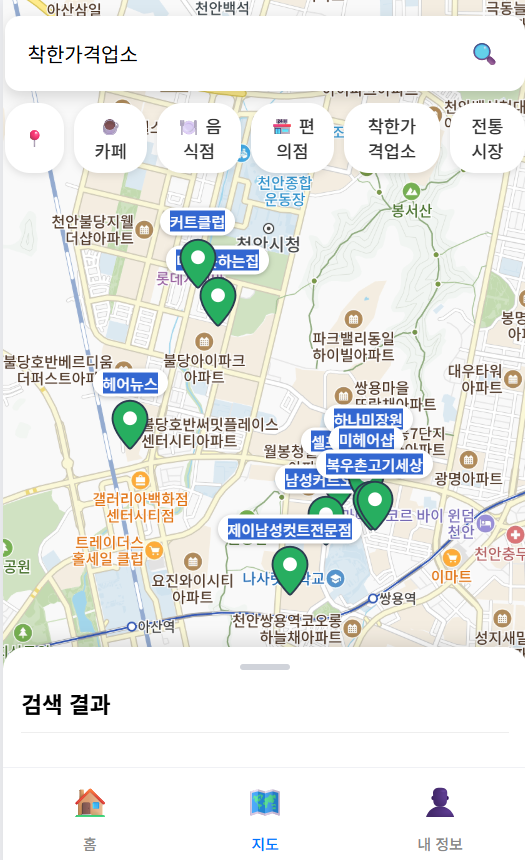 |
| '착한가격업소' 검색 시 일반 가게(파란 핀)와 색으로 구분 |

### 3. 가게 상세 / 리뷰

| 가게 상세 |                     리뷰 · 사진                     |
|:---:|:-----------------------------------------------:|
| 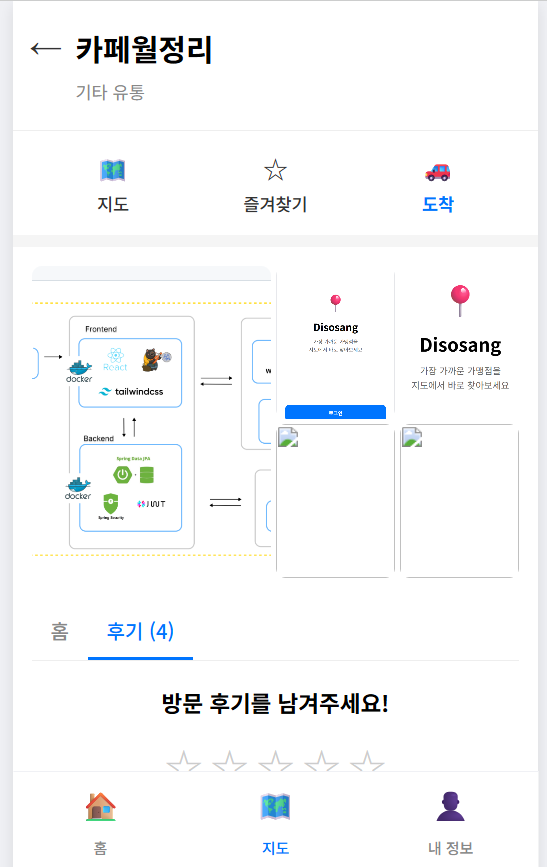 | 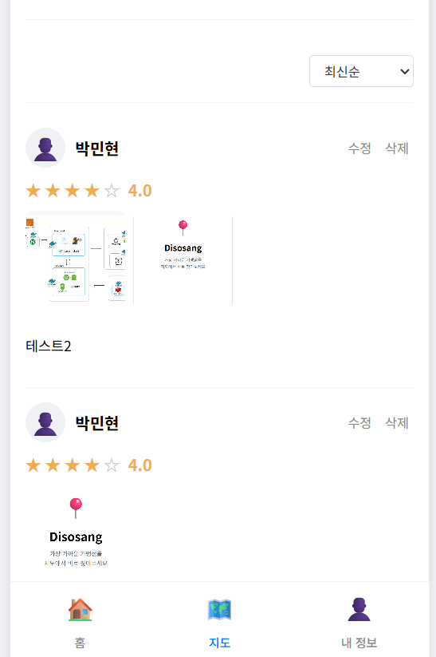 |
| 지도 이동 · 즐겨찾기 · 도착(길찾기) · 후기 |                별점 + 사진 리뷰 작성/조회                 |

### 4. 찜(즐겨찾기)

| 상세에서 찜 | 지도 핀 변경 | 홈 — 찜 목록 |
|:---:|:---:|:---:|
| 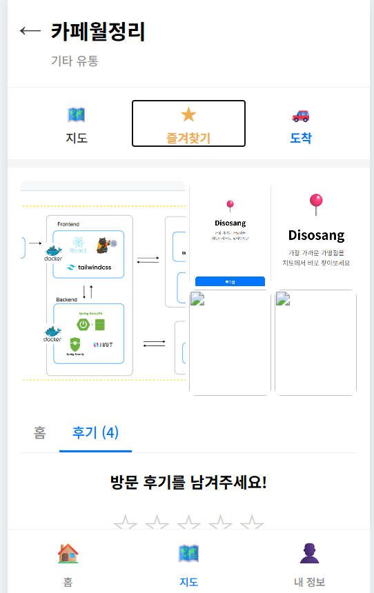 | 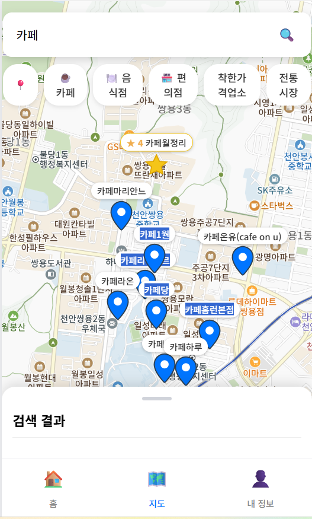 | 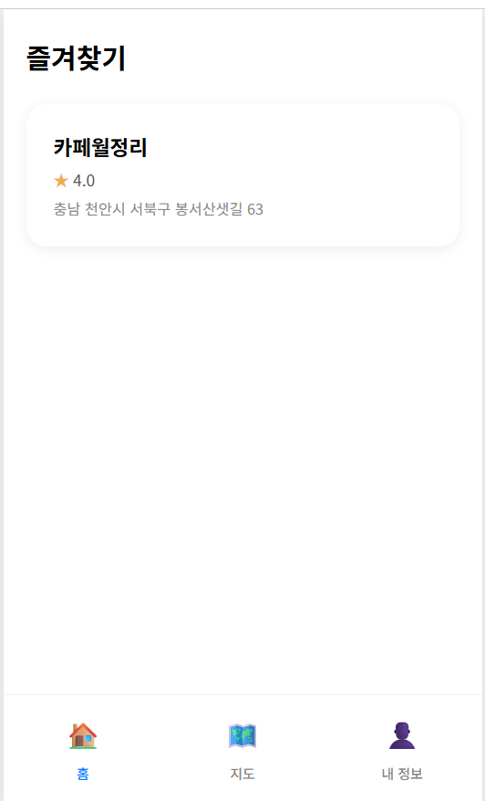 |
| 즐겨찾기 ON | 찜한 가게는 지도에서 핀 색 구분 | 홈 탭에 찜한 가게 모음 |

### 5. 길찾기

상세의 **'도착'** 을 누르면 현위치 기준으로 카카오맵 길찾기로 연결됩니다.

<div align="center">

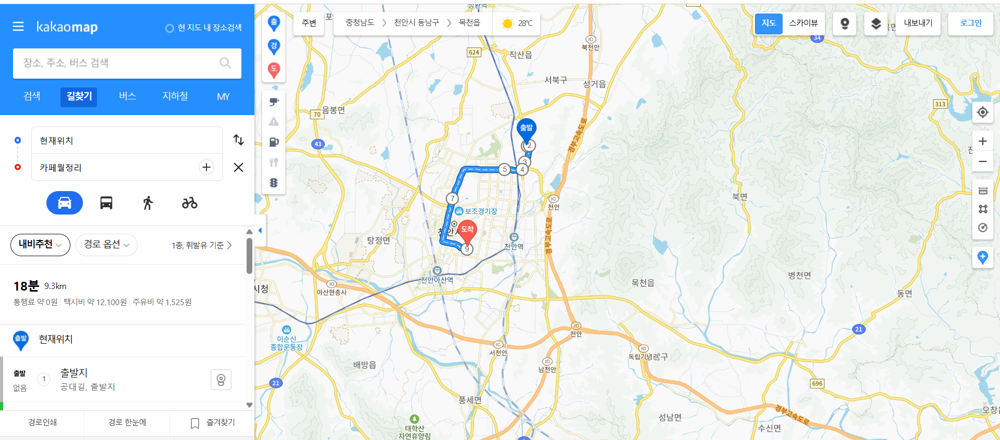

</div>

### 6. 내 정보

|                       내 정보                       |
|:------------------------------------------------:|
| 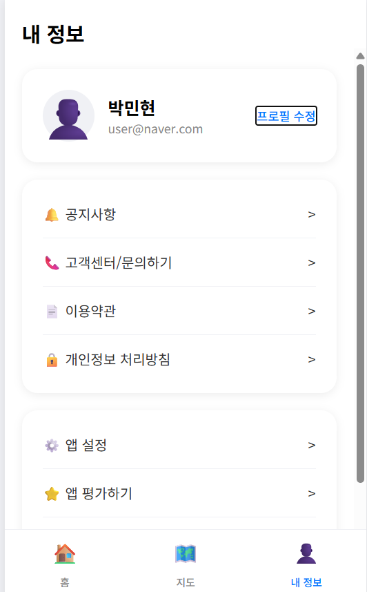 |
|                       프로필                        |

---


